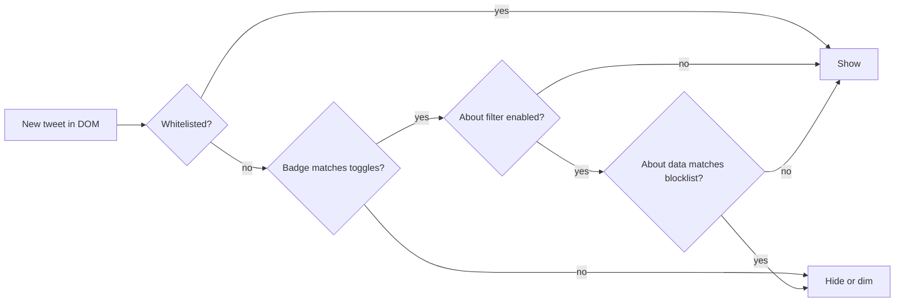

# Hide Unverified X

<p align="center">
  
</p>

<p align="center">
  <strong>Filter spam on X by verification badge and account origin — locally, with no API keys.</strong>
</p>

<p align="center">
  <a href="https://github.com/kevinchau/hide-unverified-x/blob/main/LICENSE"></a>
  <a href="https://github.com/kevinchau/hide-unverified-x/releases/tag/v1.5.0"></a>
  
  
  
</p>

A lightweight browser extension for **Chrome** and **Firefox** that filters posts on [X](https://x.com) by:

- **Verification badge** — blue, gold, and silver (government) checks, toggled independently
- **About this account** — `Account based in` and `Connected via` (e.g. `India App Store`)

Everything runs in your browser. No developer API keys. No tracking.

---

## Contents

- [Features](#features)
- [Quick start](#quick-start)
- [Popup settings](#popup-settings)
- [About-account filter](#about-account-filter)
- [Advanced settings](#advanced-settings)
- [How it works](#how-it-works)
- [Project structure](#project-structure)
- [Privacy](#privacy)
- [Changelog](#changelog)
- [License](#license)

---

## Features

| Area | What you get |
| --- | --- |
| **Verification** | Hide or dim posts without a selected badge type (blue, gold, silver) |
| **Context** | Separate toggles for **For you**, **Following**, and **Replies** |
| **About-account** | Blocklist/allowlist by region or App Store string from `/username/about` |
| **Softer UX** | Placeholder cards with **Show once** and **Always show** |
| **Whitelist** | Always show specific handles or all accounts you follow |
| **Cross-browser** | Manifest V3 for Chrome and Firefox |

---

## Quick start

### Chrome

1. [Download the repo](https://github.com/kevinchau/hide-unverified-x/archive/refs/heads/main.zip) or clone it
2. Open `chrome://extensions`
3. Enable **Developer mode**
4. Click **Load unpacked** and select this folder

### Firefox

1. Download or clone the repo
2. Open `about:debugging#/runtime/this-firefox`
3. Click **Load Temporary Add-on**
4. Select `manifest.json`

> Temporary Firefox add-ons are removed when the browser restarts. For a permanent install, package and sign via [Mozilla Add-on Developer Hub](https://addons.mozilla.org/developers/).

### Recommended first setup

1. Open the extension popup on X
2. Leave **Blue check** and **Gold check** on (default)
3. Turn on **Silver check** if you want government officials visible
4. Enable **About-account filter** for For you / Replies if you want region blocking
5. In **Advanced settings**, click **Use suggested spam blocklist** for South Asia + Africa presets

---

## Popup settings

| Setting | What it does |
| --- | --- |
| **For you / Following / Replies** | Verification filtering per feed context |
| **About-account filter** | Filter For you / Replies using About this account data |
| **Blue / Gold / Silver check** | Choose which badge types count as verified |
| **Hide / Dim** | Remove posts entirely, or fade them out |
| **Placeholder cards** | Show a slim reveal bar when hiding |
| **Accounts you follow** | Blanket whitelist for everyone you follow |

The popup also shows how many posts are hidden in the current X tab.

### Verification badges

| Badge | Default | Meaning |
| --- | --- | --- |
| **Blue** | On | Individual verified accounts |
| **Gold** | On | Verified organizations |
| **Silver** | Off | Government officials |

Posts from accounts without any **enabled** badge type are filtered.

---

## About-account filter

Uses the same fields as [About this account](https://x.com/zundamotisuki/about):

| Field | Example |
| --- | --- |
| **Account based in** | `India`, `South Asia`, `Nigeria`, `Africa` |
| **Connected via** | `India App Store`, `Nigeria App Store` |

**How lookups work**

1. Visiting an `/about` page captures data passively (no extra request)
2. Uncached feed authors are fetched via X's internal `AboutAccountQuery` using your logged-in session
3. Results are cached locally and queued slowly (~1.5s apart) to reduce rate limits
4. No Twitter Developer Portal API keys required

Configure blocklist/allowlist terms in **Advanced settings**. Match based-in, connected-via, or both. Unknown or still-loading accounts default to **show**.

### Suggested spam blocklist

One click in Advanced settings applies a curated list for common spam regions:

- **South Asia** — region plus Afghanistan, Bangladesh, Bhutan, India, Maldives, Nepal, Pakistan, Sri Lanka, and App Store strings
- **Africa** — all 54 countries plus Africa / Sub-Saharan Africa / North Africa regions and common App Store strings

Shortcuts `southasia` and `africa` still expand automatically.

---

## Advanced settings

Open from the popup, or right-click the extension icon → **Options**.

| Setting | What it does |
| --- | --- |
| **Retweets** | Filter by original author or reposter |
| **Quote tweets** | Filter by quoter or quoted author |
| **About-account filter** | Blocklist/allowlist, match fields, unknown-account behavior |
| **Whitelist** | Handles always shown, one per line |
| **Always show accounts you follow** | Builds a local follow list from timeline GraphQL responses |

**Placeholder actions**

- **Show once** — reveal until you reload the tab
- **Always show** — add the author to your whitelist

---

## How it works



1. A content script watches `article[data-testid="tweet"]` via `MutationObserver`
2. Verification is read from badge SVGs in the tweet DOM
3. About-account data comes from `AboutAccountQuery` or passive `/about` intercepts
4. Filtered posts are hidden or dimmed; optional placeholder cards offer reveal actions

---

## Project structure

```
hide-unverified-x/
├── manifest.json
├── page-interceptor.js   # Captures AboutAccountQuery in-page
├── about-account.js      # Cached AboutAccountQuery lookups
├── following-cache.js    # Cached follow relationships from GraphQL
├── country-match.js      # Blocklist/allowlist matching
├── background.js         # Per-tab hidden count relay
├── content.js            # Tweet filtering logic
├── content.css
├── popup/                # Quick settings
├── options/              # Advanced settings
└── icons/
```

---

## Privacy

This extension does not collect, transmit, or sell personal data. It stores only:

- Your settings and whitelist
- Locally cached About-account lookups

All processing happens in your browser.

---

## Changelog

See [CHANGELOG.md](CHANGELOG.md) for release history.

---

## License

MIT — see [LICENSE](LICENSE).